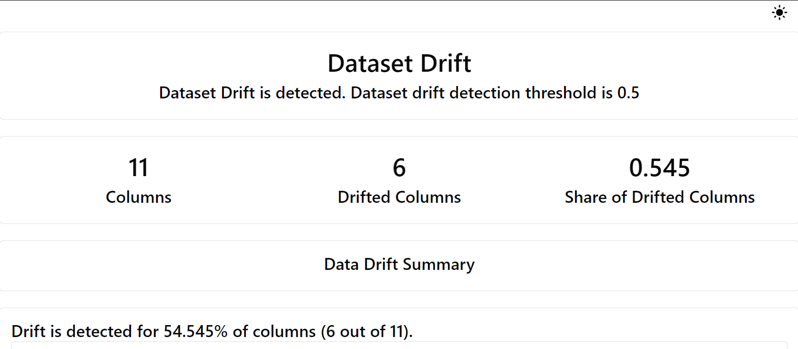

# End to End Customer Churn Prediction 

## :page_facing_up: Problem Statement
Customer churn is a critical issue for businesses as it directly impacts profitability and growth. This application aims to predict whether a customer will leave a service or product based on historical data and behavioral patterns.

## :dart: Objective
The main objective of this application is to develop a machine learning model that accurately predicts customer churn. By identifying at-risk customers, businesses can take proactive measures to enhance customer retention and improve overall satisfaction.

## 🛠️ Technological Stack
- **Python** -  The primary programming language used for development.
- **Machine Learning** - Algorithms to analyze customer data and predict churn.
- **MLOps** - Practices for deploying and maintaining machine learning models.
- **ZenML** -  A tool to create reproducible ML pipelines.
- **MLflow** -  For tracking experiments and managing model lifecycle.
- **Streamlit** -  A user-friendly UI framework for creating interactive web applications.
- **FastAPI** - Back-end frameworks to build APIs for model prediction server.
- **Evidently Ai** - A tool for Model Monitering and data drift detection.

## 📝 Overview
This design document outlines the development of a web application for predicting customer churn using a dataset that includes customer Age, Support Calls , Usage Frequency, Last Interaction, Tenure, Contract Length. The application will allow users to input customer data and receive predictions on churn likelihood.


## :snake: Python Requirements 
Let's jumpt into python packages you need. you need run below commands in python enivironmemt

```
mkdir customer_churn_prediction

cd customer_churn_prediction

git clone https://github.com/sarathkumar1304/End-to-End-Customer-Churn-Prediction

python3 -m venv venv
```

Activate your virtual environment

```pip install requirements.txt```


Starting with **ZenML** an open source MLOPs Library for machine learning engineer life cycle.ZenML has react base dashboard that allows you to observe your pipeline DAG's, stacks, stack components in dashboard interface.

To access this, you need to launch  the ZenML Server and Dashboard locally, we need run run below commands


```
pip install zenml["server"]

zenml up
```

After running this commands we can visualize the dashboard locally in your browser.


Then , you run the pipeline first and then follow the steps.

```
python3 run_pipeline.py
```

run_pipeline.py has all the combined python scripts to run the pipeline at one place.Now we can visualize the pipeline in your web browser.

we can the dashboard like below 


Before the deployment we need run some commands, to intergrate with **MLFlow** for Experiment trackering  and model registry.

```
zenml integration install mlflow -y

zenml experiment-tracker register mlflow_tracker --flavor=mlflow

zenml model-deployer register mlflow_customer_churn --flavor=mlflow

zenml stack register mlflow_stack_customer_churn -a default -o default -d mlflow -e mlflow_tracker_customer_churn --set
```


After running this command we can track the experiment in mlflow dashboard locally.

```
python3 run_deployment.py
```


After running this command we  successfully deploy the model in mlflow server that returns this url for further prediction  http://127.0.0.1:8000/invocations for further predicition.

Run the below command to launch the streamlit ui.

```
streamlit run frontend/main.py
```

or we can run whole project using **Docker** by running the below command 

```
docker-compose up --build 
```
 It will run the whole project at once without any error.


## 💪 Motivation
Understanding and addressing customer churn can significantly enhance customer loyalty and reduce marketing costs associated with acquiring new customers. This application provides insights that help businesses to implement effective retention strategies.

## 📈 Success Metrics
The project's success will be measured using the following metrics:
- Precision, Recall, and F1 Score of the churn prediction model.
- Reduction in customer churn rates observed post-implementation.

## 📑 Requirements & Constraints
### Functional Requirements
- Users can input customer data to receive churn predictions.
- Users can view performance metrics of the machine learning models.
- The model should demonstrate high accuracy in predictions.

### 🚧 Constraints
- The application is built using FastAPI as backend and Streamlit as front end , with deployment on Streamlit cloud  and Containerizer using Docker

## ⚙️ Methodology
- **Problem Statement**: Develop a model to predict customer churn based on various features.
- **Data**: Utilize a dataset containing customer-related features such as demographics and service usage.
- **Techniques**: Employ data ingestion,  data preprocessing, feature engineering, model selection, training,  evaluation and model deployment.
- **zenml :** for  creating reproducible ML pipeline.
- **MLFlow:** for experiment tracking and model registry.
- **Docker :** for containerization the whole project.

## 🏛️ Architecture
The architecture of the web application consists of:
- A **frontend** built using Streamlit for user interaction.
- A **backend** server implemented with FastAPI for handling requests and serving predictions.
- A **machine learning model** for churn prediction.
- Utilization of **Docker** for containerization.
- Hosting on **Streamlit Cloud** with a CI/CD pipeline for automated deployment.


## 🖇️ Pipeline 


The MLOps (Machine Learning Operations) pipeline project is designed to create an end-to-end workflow for developing and deploying a web application that performs data preprocessing, model training, model evaluation, and prediction. The pipeline leverages Docker containers for encapsulating code, artifacts, and both the frontend and backend components of the application. The application is deployed on a Streamlit  to provide a cloud hosting solution.

The pipeline follows the following sequence of steps:

**Data Ingestion**: The pipeline starts with the input data, which is sourced from a specified location. It can be in the form of a CSV file.

**Preprocessing:** The data undergoes preprocessing steps to clean, transform, and prepare it for model training. This stage handles tasks such as missing value imputation, feature scaling, and categorical variable encoding.

**Model Training:** The preprocessed data is used to train machine learning models. The pipeline supports building multiple models, allowing for experimentation and comparison of different algorithms or hyperparameters.

**Model Evaluation:** The trained models are evaluated using appropriate evaluation metrics to assess their performance. This stage helps in selecting the best-performing model for deployment.

**Docker Container:** The pipeline utilizes Docker containers to package the application code, model artifacts, and both the frontend and backend components. This containerization ensures consistent deployment across different environments and simplifies the deployment process.

**Streamlit:** The Docker container, along with the required dependencies, is deployed on a  droplet Streamlit. Streamlit provides a cloud hosting solution that allows for scalability, reliability, and easy management of the web application.

**Web App:** The web application is accessible via a web browser, providing a user-friendly interface for interacting with the prediction functionality. Users can input new data and obtain predictions from the deployed model.

**Prediction:** The deployed model uses the input data from the web application to generate predictions. These predictions are then displayed to the user via the web interface.

**Evidently AI :** A tools for model monitering and data drifting detection when new data comes in. 

**CI/CD Pipeline:** The pipeline is automated using GitHub Actions, which allows for continuous integration and deployment of the application. This automation ensures that the application is always up-to-date and provides a consistent experience for users.

### 🕹️ Streamlit App 

There is a live demo of this project using Streamlit which you can find [here](https://end-to-end-customer-churn-prediction-9en8mwgk9xqgy8z7envfmm.streamlit.app/) 

## Video

<iframe width="560" height="315" src="https://www.youtube.com/embed/dQw4w9WgXcQ" frameborder="0" allow="accelerometer; autoplay; clipboard-write; encrypted-media; gyroscope; picture-in-picture" allowfullscreen></iframe>


## Data Report 

### Data Drift Detection using Evidently ai 




## Classification Perfomance using Evidently AI


